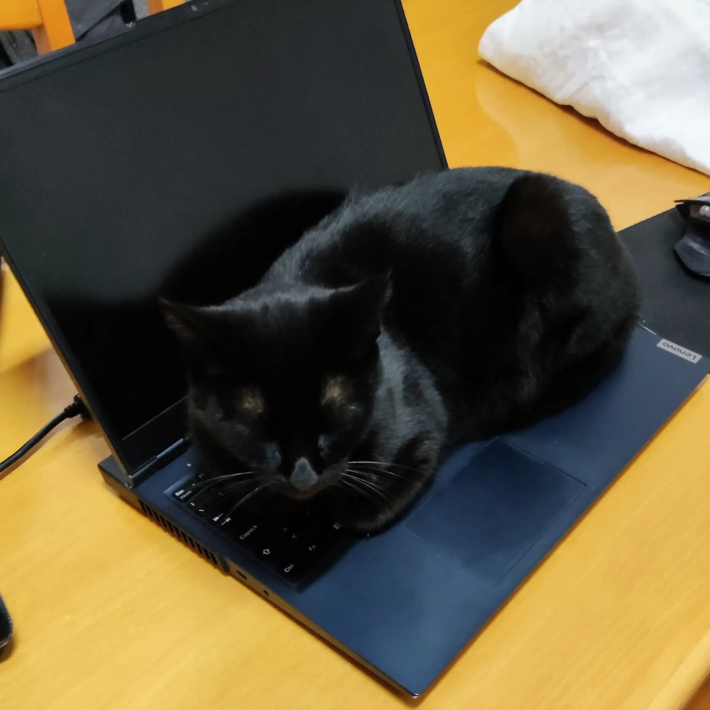

## Whiskers

## About

Whiskers Theme was created because [I](https://github.com/lighttigerxiv) got tired that all brown/yellow themes looked bad in my eyes.
This theme is very inspired by [catppuccin](https://github.com/catppuccin/catppuccin) and by the following cats :P

| Cookie                                     | Amália                                     |
| ------------------------------------------ | ------------------------------------------ |
|  |  |

## 🎨 Palette

🐈‍⬛ Panther

|                                                                     | Name         | Hex     | RGB                | HSL                 |
| ------------------------------------------------------------------- | ------------ | ------- | ------------------ | ------------------- |
|         | Banana       | #FFE072 | rgb(255, 224, 114) | hsl(47, 100%, 73%)  |
|      | Blueberry    | #A5CEFF | rgb(165, 206, 255) | hsl(213, 100%, 82%) |
|         | Cherry       | #FF8C7C | rgb(255, 140, 124) | hsl(7, 100%, 74%)   |
|          | Grape        | #FFAAF5 | rgb(255, 170, 245) | hsl(307, 100%, 83%) |
|           | Kiwi         | #B1E380 | rgb(177, 227, 128) | hsl(90, 64%, 70%)   |
|      | Tangerine    | #FFB26C | rgb(255, 178, 108) | hsl(29, 100%, 71%)  |
|        | Neutral      | #000000 | rgb(0, 0, 0)       | hsl(0, 0%, 0%)      |
|    | NeutralTwo   | #0E0600 | rgb(14, 6, 0)      | hsl(26, 100%, 3%)   |
|  | NeutralThree | #140800 | rgb(20, 8, 0)      | hsl(24, 100%, 4%)   |
|    | NeutralFour   | #1B0B00 | rgb(27 ,11, 0)     | hsl(24, 100%, 5%)   |
|   | NeutralFive  | #210D00 | rgb(33, 13, 0)     | hsl(24, 100%, 6%)   |
|    | NeutralSix   | #301300 | rgb(48, 19, 0)     | hsl(24, 100%, 9%)   |
|  | NeutralSeven | #401A00 | rgb(64, 26, 0)     | hsl(24, 100%, 13%)  |
|  | NeutralEight | #502000 | rgb(80, 32, 0)     | hsl(24, 100%, 16%)  |
|           | Text         | #FFEEE2 | rgb(255, 238, 226) | hsl(25, 100%, 94%)  |
|       | TextTwo      | #E5D2C5 | rgb(229, 210, 197) | hsl(24, 38%, 84%)   |
|     | TextThree    | #CFBBAD | rgb(207, 187, 173) | hsl(25, 26%, 75%)   |
|       | TextFour      | #B5A8A0 | rgb(181, 168, 160) | hsl(23, 12%, 67%)   |

🐯 Tiger

|                                                                   | Name         | Hex     | RGB                | HSL                |
| ----------------------------------------------------------------- | ------------ | ------- | ------------------ | ------------------ |
|         | Banana       | #A87B0A | rgb(168, 123, 10)  | hsl(43, 89%, 35%)  |
|      | Blueberry    | #5284BE | rgb(82, 132, 190)  | hsl(212, 45%, 53%) |
|         | Cherry       | #B43A2A | rgb(180, 58, 42)   | hsl(7, 62%, 44%)   |
|          | Grape        | #7D0E70 | rgb(125, 14, 112)  | hsl(307, 80%, 27%) |
|           | Kiwi         | #6A9534 | rgb(106, 149, 52)  | hsl(87, 48%, 39%)  |
|      | Tangerine    | #C15D01 | rgb(193, 93, 1)    | hsl(29, 99%, 38%)  |
|        | NeutralOne   | #FFFCF8 | rgb(255, 252, 248) | hsl(34, 100%, 99%) |
|    | NeutralTwo   | #FFF9F0 | rgb(255, 249, 240) | hsl(36, 100%, 97%) |
|  | NeutralThree | #FFF5E7 | rgb(255, 245, 231) | hsl(35, 100%, 95%) |
|    | NeutralFour   | #FFF3E2 | rgb(255, 243, 226) | hsl(35, 100%, 94%) |
|   | NeutralFive  | #FFF1DD | rgb(255, 241, 221) | hsl(35, 100%, 93%) |
|    | NeutralSix   | #FFF0DA | rgb(255, 240, 218) | hsl(36, 100%, 93%) |
|  | NeutralSeven | #FFEFD7 | rgb(255, 239, 215) | hsl(36, 100%, 92%) |
|  | NeutralEight | #FFECCF | rgb(255, 236, 207) | hsl(36, 100%, 91%) |
|           | Text         | #3E1900 | rgb(62, 25, 0)     | hsl(24, 100%, 12%) |
|       | TextTwo      | #865C3A | rgb(134, 92, 58)   | hsl(27, 40%, 38%)  |
|     | TextThree    | #A17A5A | rgb(161, 122, 90)  | hsl(27, 28%, 49%)  |
|       | TextFour      | #AE917C | rgb(174, 145, 124) | hsl(25, 24%, 58%)  |

## 🖌️ Ports

🌐 Browsers

- [Chrome](https://github.com/Whiskers-Color-Scheme/chrome)
- [Firefox](https://github.com/Whiskers-Color-Scheme/firefox)

🌆 Desktop Environments

- [KDE](https://github.com/Whiskers-Color-Scheme/kde)

🏃‍♂️ Health

- [Fitbit](https://github.com/Whiskers-Color-Scheme/fitbit)

🐛 IDEs

- [Visual Studio Code](https://github.com/Whiskers-Color-Scheme/vscode)

⌨️ Launchers

- [Whiskers Launcher](https://github.com/Whiskers-Color-Scheme/whiskers-launcher)

🎧 Music

- [Spicetify](https://github.com/Whiskers-Color-Scheme/spicetify)

🎨 Palette Libraries

- [Kotlin](https://github.com/Whiskers-Color-Scheme/whiskers-palette-kt)
- [Rust](https://github.com/Whiskers-Color-Scheme/whiskers-palette-rs)

💬 Social

- [Discord](https://github.com/Whiskers-Color-Scheme/discord)

💻 Terminal

- [Alacritty](https://github.com/Whiskers-Color-Scheme/alacritty)
- [Fish](https://github.com/Whiskers-Color-Scheme/fish)
- [Konsole](https://github.com/Whiskers-Color-Scheme/konsole)
- [Starship](https://github.com/Whiskers-Color-Scheme/starship)
- [Windows Terminal](https://github.com/Whiskers-Color-Scheme/windows-terminal)

🪟 Display Managers

- [SDDM](https://github.com/Whiskers-Color-Scheme/sddm)
