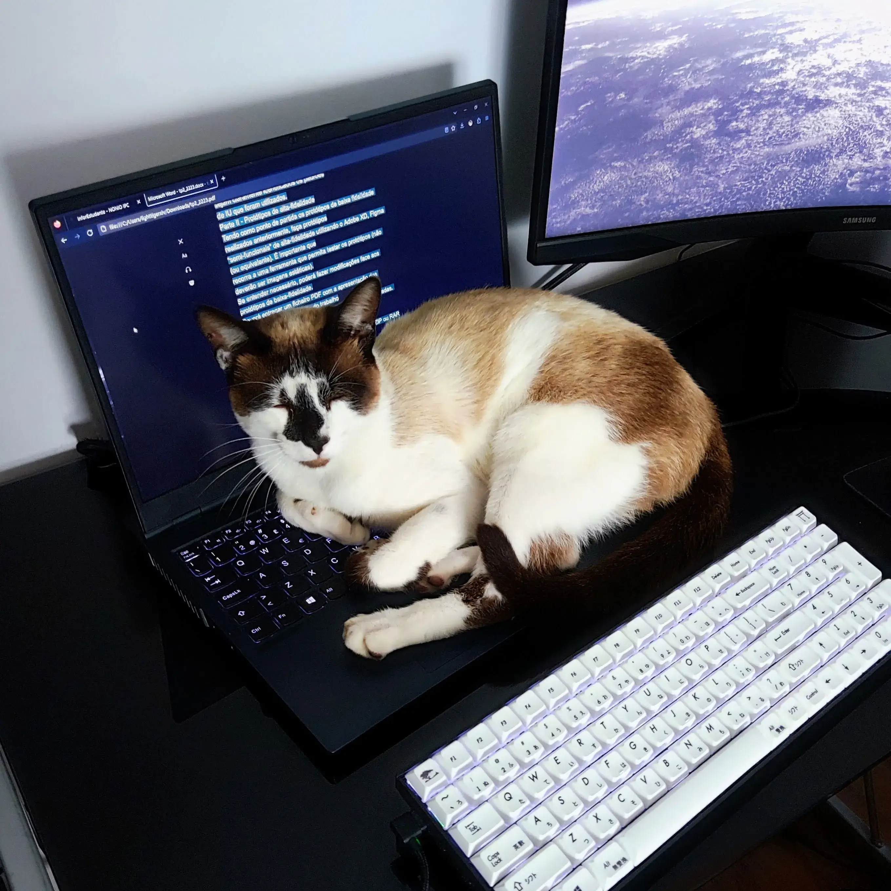

Logo

## Whiskers Theme

## 🎨 Palette

🐈‍⬛ Panther

| Preview | Name         | Hex     | RGB              | HSL                   |
| ------- | ------------ | ------- | ---------------- | --------------------- |
|         | Banana       | #FFE072 | rgb(255,224,114) | hsl(46.8,100%,72.4%)  |
|         | Blueberry    | #A5CEFF | rgb(165,206,255) | hsl(212.7,100%,82.4%) |
|         | Cherry       | #FF8C7C | rgb(255,140,124) | hsl(7.3,100%,74.3%)   |
|         | Grape        | #FFAAF5 | rgb(255,170,245) | hsl(307.1,100%,83.3%) |
|         | Kiwi         | #B1E380 | rgb(177,227,128) | hsl(90.3,63.9%,69.6%) |
|         | Tangerine    | #FFB26C | rgb(255,178,108) | hsl(28.6,100%,71.2%)  |
|         | NeutralOne   | #000000 | rgb(0,0,0)       | hsl(0,0%,0%)          |
|         | NeutralTwo   | #0E0600 | rgb(14,6,0)      | hsl(25.7,100%,2.7%)   |
|         | NeutralThree | #140800 | rgb(20,8,0)      | hsl(24,100%,3.9%)     |
|         | NeutralFor   | #1B0B00 | rgb(27,11,0)     | hsl(24.4,100%,5.3%)   |
|         | NeutralFive  | #210D00 | rgb(33,13,0)     | hsl(23.6,100%,6.5%)   |
|         | NeutralSix   | #301300 | rgb(48,19,0)     | hsl(23.8,100%,9.4%)   |
|         | NeutralSeven | #401A00 | rgb(64,26,0)     | hsl(24.4,100%,12.5%)  |
|         | NeutralEight | #502000 | rgb(80,32,0)     | hsl(24,100%,15.7%)    |
|         | Text         | #FFEEE2 | rgb(255,238,226) | hsl(24.8,100%,94.3%)  |
|         | SubText      | #E5D2C5 | rgb(229,210,197) | hsl(24.4,38.1%,83.5%) |
|         | Disabled     | #8A512B | rgb(138,81,43)   | hsl(24,52.5%,35.5%)   |

🐯 Tiger

| Preview | Name         | Hex     | RGB              | HSL                    |
| ------- | ------------ | ------- | ---------------- | ---------------------- |
|         | Banana       | #A87B0A | rgb(168,123,10)  | hsl(42.9,88.8%,34.9%)  |
|         | Blueberry    | #5284BE | rgb(82,132,190)  | hsl(212.2,45.4%,53.3%) |
|         | Cherry       | #B43A2A | rgb(180,58,42)   | hsl(7,62.2%,43.5%)     |
|         | Grape        | #6A9534 | rgb(106,149,52)  | hsl(86.6,48.3%,39.4%)  |
|         | Kiwi         | #7D0E70 | rgb(125,14,112)  | hsl(307,79.9%,27.3%)   |
|         | Tangerine    | #C15D01 | rgb(193,93,1)    | hsl(28.8,99%,38%)      |
|         | NeutralOne   | #FFFCF8 | rgb(255,252,248) | hsl(34.3,100%,98.6%)   |
|         | NeutralTwo   | #FFF9F0 | rgb(255,249,240) | hsl(36,100%,97.1%)     |
|         | NeutralThree | #FFF5E7 | rgb(255,245,231) | hsl(35,100%,95.3%)     |
|         | NeutralFor   | #FFF3E2 | rgb(255,243,226) | hsl(35.2,100%,94.3%)   |
|         | NeutralFive  | #FFF1DD | rgb(255,241,221) | hsl(35.3,100%,93.3%)   |
|         | NeutralSix   | #FFF0DA | rgb(255,240,218) | hsl(35.7,100%,92.7%)   |
|         | NeutralSeven | #FFEFD7 | rgb(255,239,215) | hsl(36,100%,92.2%)     |
|         | NeutralEight | #FFECCF | rgb(255,236,207) | hsl(36.3,100%,90.6%)   |
|         | Text         | #3E1900 | rgb(62,25,0)     | hsl(24.2,100%,12.2%)   |
|         | SubText      | #865C3A | rgb(134,92,58)   | hsl(26.8,39.6%,37.6%)  |
|         | Disabled     | #A17F68 | rgb(161,127,104) | hsl(24.2,23.3%,52%)    |

## 🌳 Inspiration

This theme is heavily inspired by catppuccin and the following cats :P

